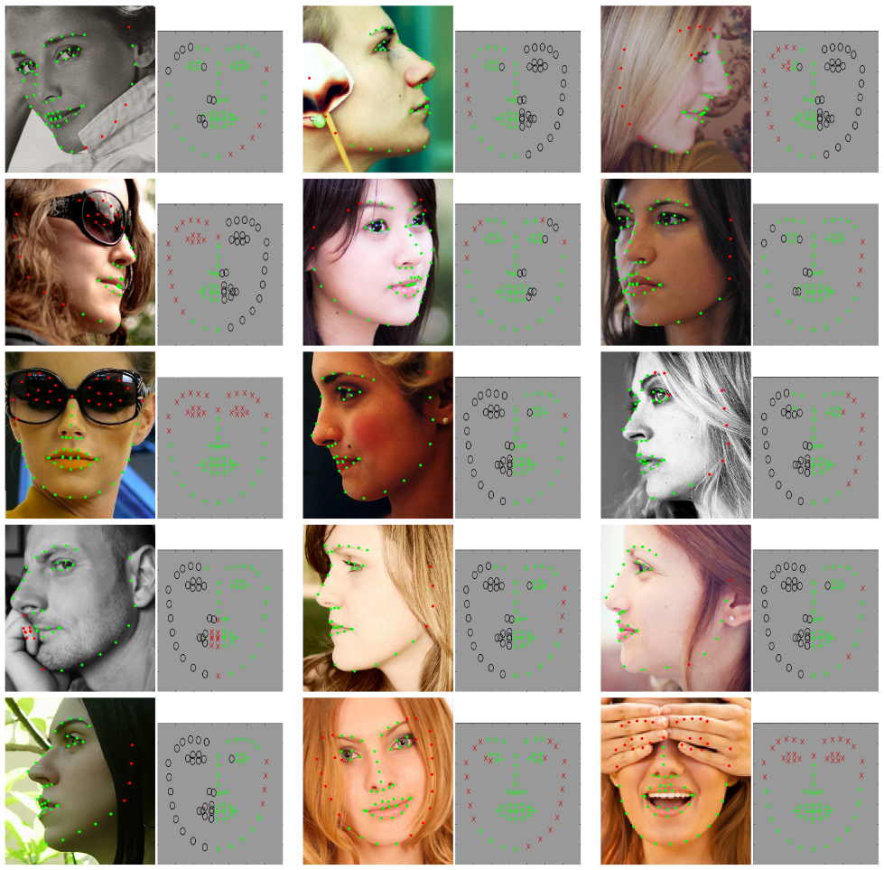
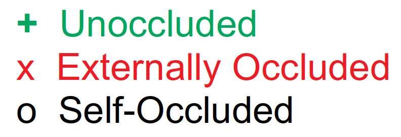

# MERL-RAV Dataset
<p align="center"></p>
<p align="center"></p>

The MERL-RAV ([MERL](https://www.merl.com/) Reannotation of AFLW with Visibility) Dataset contains over 19,000 face images in a full range of head poses. Each face is manually labeled with the ground-truth locations of 68 landmarks, with the additional information of whether each landmark is unoccluded, self-occluded (due to extreme head poses), or externally occluded. The images were annotated by professional labelers, supervised by researchers at Mitsubishi Electric Research Laboratories (MERL). 

Please cite the following [CVPR paper](https://openaccess.thecvf.com/content_CVPR_2020/papers/Kumar_LUVLi_Face_Alignment_Estimating_Landmarks_Location_Uncertainty_and_Visibility_Likelihood_CVPR_2020_paper.pdf) if you use this dataset in your research:

```Bibtex
@inproceedings{kumar2020luvli,
  title={LUVLi Face Alignment: Estimating Landmarks' Location, Uncertainty, and Visibility Likelihood},
  author={Kumar, Abhinav and Marks, Tim K. and Mou, Wenxuan and Wang, Ye and Jones, Michael and Cherian, Anoop and Koike-Akino, Toshiaki and Liu, Xiaoming and Feng, Chen},
  booktitle={IEEE/CVF Conference on Computer Vision and Pattern Recognition (CVPR)},
  year={2020}
}
```

Please also consider citing the original [AFLW dataset](https://www.tugraz.at/institute/icg/research/team-bischof/lrs/downloads/aflw/).

### Instructions
Download this repository, and unzip it into a project directory.
```bash
cd $PROJECT_DIR
```

Then, download the AFLW dataset (underneath the same project directory) by following the instructions [here](https://www.tugraz.at/institute/icg/research/team-bischof/lrs/downloads/aflw/), and move the downloaded dataset into the same project directory as this repository.

The project directory should look like this:
```bash
├── merl_rav_labels
│      ├── frontal
│      │      ├── testset
│      │      └── trainset
│      │
│      ├── left 
│      │      ├── testset
│      │      └── trainset
│      │
│      ├── lefthalf
│      │      ├── testset
│      │      └── trainset
│      │
│      ├── right
│      │      ├── testset
│      │      └── trainset
│      │
│      └── righthalf
│             ├── testset
│             └── trainset
├── aflw
│      └── flickr
│             ├── 0
│             ├── 2
│             └── 3
├── common_functions.py
├── organize_merl_rav_using_aflw_and_our_labels.py
```
If your ```aflw``` folder is located elsewhere, then just set the path in the ```input_folder``` variable of the file ```organize_merl_rav_using_aflw_and_our_labels.py```

Next, execute the following command:
```bash
python organize_merl_rav_using_aflw_and_our_labels.py
```

The script goes through the sub-folders of the ```merl_rav_labels``` folder. For each label file (e.g., ```image12345.pts```), it locates and copies the corresponding image file (```image12345.jpg```) from the ```aflw``` folder. It copies both the label file and image file into a folder named ```merl_rav_organized```, in the same project directory. After the script has completed, this folder will have the following sub-folders:

```bash
├── merl_rav_organized
│      ├── frontal
│      │      ├── testset
│      │      └── trainset
│      │
│      ├── left 
│      │      ├── testset
│      │      └── trainset
│      │
│      ├── lefthalf
│      │      ├── testset
│      │      └── trainset
│      │
│      ├── right
│      │      ├── testset
│      │      └── trainset
│      │
│      └── righthalf
│             ├── testset
│             └── trainset
│
├── merl_rav_labels
├── aflw
├── common_functions.py
├── organize_merl_rav_using_aflw_and_our_labels.py
```
Each of the ```testset``` and ```trainset``` sub-folders in the ```merl_rav_organized``` folder contains corresponding pairs of label files and image files. The image file and the corresponding ground-truth label file have the same file name, but a different extension: Labels files end with ```.pts``` , while image files end with ```.jpg```. For example, for the image with filename ```image03891.jpg```, the landmark labels are in the text file named ```image03891.pts```.

### Multiple Faces in a Single Image

Some images in the dataset contain more than one labeled face. When that happens, the label and image filenames include  ```_1```, ```_2```, etc. to index which face in the image is being annotated.

For example, the ```aflw``` image file ```image20991.jpg``` contains two faces. The ground-truth landmark labels for those two faces are contained in two files (one for each face): ```merl_rav_labels/frontal/trainset/image20991_1.pts``` and  ```merl_rav_labels/frontal/trainset/image20991_2.pts```. 

For convenience, the script automatically duplicates this AFLW image and appends ```_1``` and ```_2``` to produce ```merl_rav_organized/frontal/trainset/image20991_1.jpg``` and ```merl_rav_labels/frontal/trainset/image20991_2.jpg```. (Both images are identical to the original AFLW image.) That way, there is a one-to-one correspondence between label files and image files in the ```merl_rav_organized``` folder, and the filenames only differ in their extension (```.jpg``` or ```.pts```).

### Format of the Label Files

We follow the 68-landmark labeling scheme of the [300-W](https://ibug.doc.ic.ac.uk/resources/300-W/) and Multi-PIE datasets.

As explained above, each landmark in each image is identified as belonging to one of three occlusion classes: unoccluded, externally occluded, or self-occluded. The coordinate values of each landmark in a ```.pts``` file depend on that landmark's occlusion class, as follows:

| Occlusion Type      |  Meaning  | Coordinate Labels | Landmark Location |
| ---------------------| ----------| -----------------|----------------|
| Unoccluded           | Landmark is clearly visible. | Positive coordinates <br />```(x, y)``` | (x, y) |
| Externallly Occluded |  Landmark is occluded by an external object (such as the subject’s hair, hand, glasses, a microphone, etc.). *Landmark location is estimated.*  | Negative coordinates <br />```(-x, -y)``` | (x, y) |
| Self-Occluded        | Landmark is not visible because it is occluded by another part of the subject’s face. *Landmark location is not even estimated.* | ```(-1, -1)``` | Not estimated.|


As an example, consider the first several lines of one of the label (```.pts```) files:

```matlab
version: 1
n_points:  68       # <-- MERL-RAV uses a 68-landmark markup system.
{
-1 -1               # <-- Landmarks 1, 2, and 3 are self-occluded.
-1 -1               #     Their locations are not estimated.
-1 -1
-1443.54 -474.32    # <-- Landmark 4 is externally occluded.
                    #     Its estimated location is (1443.54, 474.32).
-1420.02 -535.08
-1388.66 -603.68
1382.78 680.12      # <-- Landmark 7 is unoccluded.
                    #     Its estimated location is (1382.78, 680.12).
1372.98 758.52
…
}
```


## Contact

In case of any queries, feel free to drop an email to 
[Abhinav Kumar](https://sites.google.com/view/abhinavkumar/) (```abhinav3663@gmail.com```) or [Tim Marks](http://www.merl.com/people/tmarks) (```tmarks@merl.com```)
